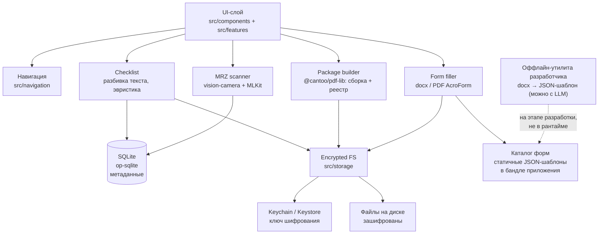

# Архитектура

Обзор системы. Обоснования отдельных решений — в [ADR](./adr/), фазы
разработки — в [`CLAUDE.md`](../CLAUDE.md).

## Контекст

Мобильное приложение (bare React Native, Android + iOS). Помогает собрать
пакет документов для визы/ВНЖ/ПМЖ: чек-лист из вставленного пользователем
текста → загрузка файлов → финальный PDF-пакет с реестром. Отдельно —
автозаполнение официальных форм (docx/PDF) данными из уже загруженных
документов.

Ключевая особенность, определяющая всю архитектуру: приложение обрабатывает
**паспортные данные и сканы личных документов**. Это самая чувствительная
категория ПД, какая бывает у обычного пользователя, и в юрисдикции ЕС она
подпадает под GDPR. Отсюда — local-first без сервера (ADR-0002) и
детерминированный офлайн-парсер вместо LLM в рантайме (ADR-0004).

## Компоненты

Пунктирная стрелка — единственное место, где участвует LLM: разбор новой
формы разработчиком. У пользователя в рантайме сети нет вообще.

## Границы доверия

| Граница | Что пересекает | Контроль |
|---|---|---|
| Пользователь → приложение | Текст требований, файлы документов, кадр с паспортом | Всё остаётся на устройстве |
| Приложение → диск | Файлы документов | Шифрование, ключ в Keychain/Keystore |
| Приложение → сеть | **Ничего** (фазы 0-5) | Разрешение `INTERNET` не объявлено в release-манифесте |
| Разработчик → каталог форм | JSON-шаблоны | Версионируются, ревьюятся, лежат в бандле |

## Нефункциональные требования

Приложение однопользовательское и офлайновое, поэтому привычные NFR
серверных систем (RPS, доступность, стоимость инфраструктуры) неприменимы —
сервера нет. Значимые:

**Приватность и безопасность (главный NFR).**
Данные: паспортные, сканы личных документов — специальная категория ПД,
GDPR. Аутентификация внутри приложения не нужна: доступ ограничен
блокировкой экрана устройства. Шифрование at rest — обязательно. Передачи
данных нет вообще, поэтому шифрование in transit неприменимо до Фазы 6;
если появится облако — только E2E (ADR-0002).

**Надёжность.**
Единственная копия данных — на устройстве. Потеря/сброс телефона = потеря
пакета документов; резервного копирования нет, `android:allowBackup="false"`
осознанно отключает и автобэкап Google. Это принятый компромисс ради
приватности, но он должен быть явно проговорён пользователю в UI (см.
раздел «Риски»).

**Корректность (критично для этого продукта).**
Ошибка в номере паспорта в поданной форме дороже, чем неудобство ручного
ввода: заявление могут отклонить, а срок подачи — упустить. Отсюда два
жёстких правила: каждое автозаполненное поле подтверждается пользователем
вручную, и финальный экран формулируется как «отмечено N из N пунктов
чек-листа», а не «всё готово» (ADR-0005).

**Производительность.**
Ориентиры: сборка PDF-пакета из ~20 сканов — единицы секунд, без блокировки
UI-потока; MRZ-распознавание — в реальном времени с камеры. Списки
документов и пунктов чек-листа рендерятся через `FlatList`, не `ScrollView`.

**Поддерживаемость.**
Ведомства меняют формы без предупреждения. Каталог версионируется, а
сопоставление загруженного файла с шаблоном идёт по структурному
fingerprint, а не по имени файла (ADR-0003), — иначе обновлённая форма
молча заполнится по устаревшему маппингу.

## Риски

| Риск | Вероятность | Последствие | Митигация |
|---|---|---|---|
| Ведомство обновило форму, fingerprint не совпал | Высокая | Автозаполнение недоступно | Явное сообщение «форма не распознана» + ручное заполнение; версионирование каталога |
| Ведомство обновило форму, fingerprint совпал ошибочно | Низкая | **Данные в неверных полях** | Fingerprint по структуре, обязательное подтверждение полей пользователем |
| MRZ распознал символ неверно (`0`/`O`, `1`/`I`) | Средняя | Неверный номер документа | Проверка контрольных цифр MRZ + ручное подтверждение каждого поля |
| Потеря устройства | Средняя | Потеря всех документов | Честно предупредить в UI; экспорт пакета наружу как ручной бэкап |
| `react-native-keychain` не отдаёт ранее сохранённый ключ (известный баг, Android) | Неизвестна, не 0 | Тот же эффект, что при потере устройства, но без потери самого устройства | Проверка чтения сразу после записи ключа + честная ошибка вместо падения; см. [ADR-0008](./adr/0008-known-risk-keychain-decryption-failures.md) |
| Одно поле формы соответствует нескольким значениям | Известная | Некорректное заполнение | Заполнять одной строкой либо оставлять поле пользователю |
| Регулирование «иммиграционного консультирования» | Неизвестная | Блокировка монетизации | Проверить до платного тарифа; позиционировать как инструмент, не консультацию |

## Что осознанно НЕ делается

- **Нет бэкенда.** Ни синхронизации, ни аналитики, ни crash-репортинга с
  сервером — до Фазы 6 и отдельного ADR.
- **Нет ML/NLP в разбивке чек-листа.** Простая эвристика по строкам:
  пользователь видит результат сразу и правит руками.
- **Нет общего OCR.** Только MRZ — узкая задача с контрольными цифрами
  (ADR-0005).
- **Нет content controls в docx-парсере.** Только legacy form fields —
  такими сделаны реальные ведомственные формы.
